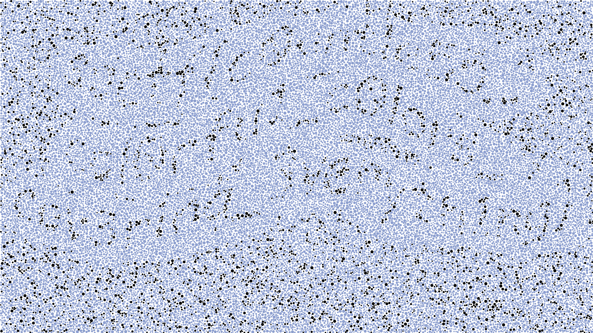

# ishihara test++

**Solution**: 

An ishihara test is a test for color blindness that involves differently colored circles that form a number.  To a color blind person, the number won't be apparent because they have trouble differentiating some of the colors of the circles.  In the file given for this challenge, at first glance, all the circles look like they're the same color.  However, they're probably just very close shades that we can't tell apart.  

I was originally going to process the file using Python to find the color of each circle and then change the colors manually.  However, I opened the file using TextEdit and discovered that it was an `svg` file with circles that were assigned one of 6 colors through the `class` property.  All of these colors were one hex color code away from each other, so we couldn't tell them apart.  Below are the first few lines of `flag.svg` when opened in TextEdit.
```
<style>.c1{fill:#89a1d1;}.c2{fill:#89a1d2;}.c3{fill:#89a1d3;}.c4{fill:#89a1d4;}.c5{fill:#89a1d5;}.c6{fill:#89a1d6;}</style>
<circle cx="1403.7309924917913" cy="656.4300466535069" r="2.1780044815555906" class="c5" />
<circle cx="1706.3779259092448" cy="606.6103722848989" r="4.8300364856314815" class="c4" />
<circle cx="343.99898734356174" cy="920.6559407124367" r="3.519456560536894" class="c6" />
<circle cx="450.4499897108796" cy="36.312128513143094" r="4.75976605176772" class="c5" />
...
```

I tried changing the hex color code for one of the styles and then opening the file back up, resulting in this line for my styles and this image. 
```
<style>.c1{fill:#89a1d1;}.c2{fill:#89a1d2;}.c3{fill:#000000;}.c4{fill:#89a1d4;}.c5{fill:#89a1d5;}.c6{fill:#89a1d6;}</style>
```


At this point, I see something resembling words starting to form in the middle of the image.  I changed another one of the styles, trying different styles until I saw more words starting to form.  This was my final styles line and image, giving us the flag of `sdctf{c0untle55_col0fu1_c0lors_cov3ring_3veryth1ng}`.
```
<style>.c1{fill:#000000;}.c2{fill:#89a1d2;}.c3{fill:#000000;}.c4{fill:#89a1d4;}.c5{fill:#89a1d5;}.c6{fill:#000000;}</style>
```
