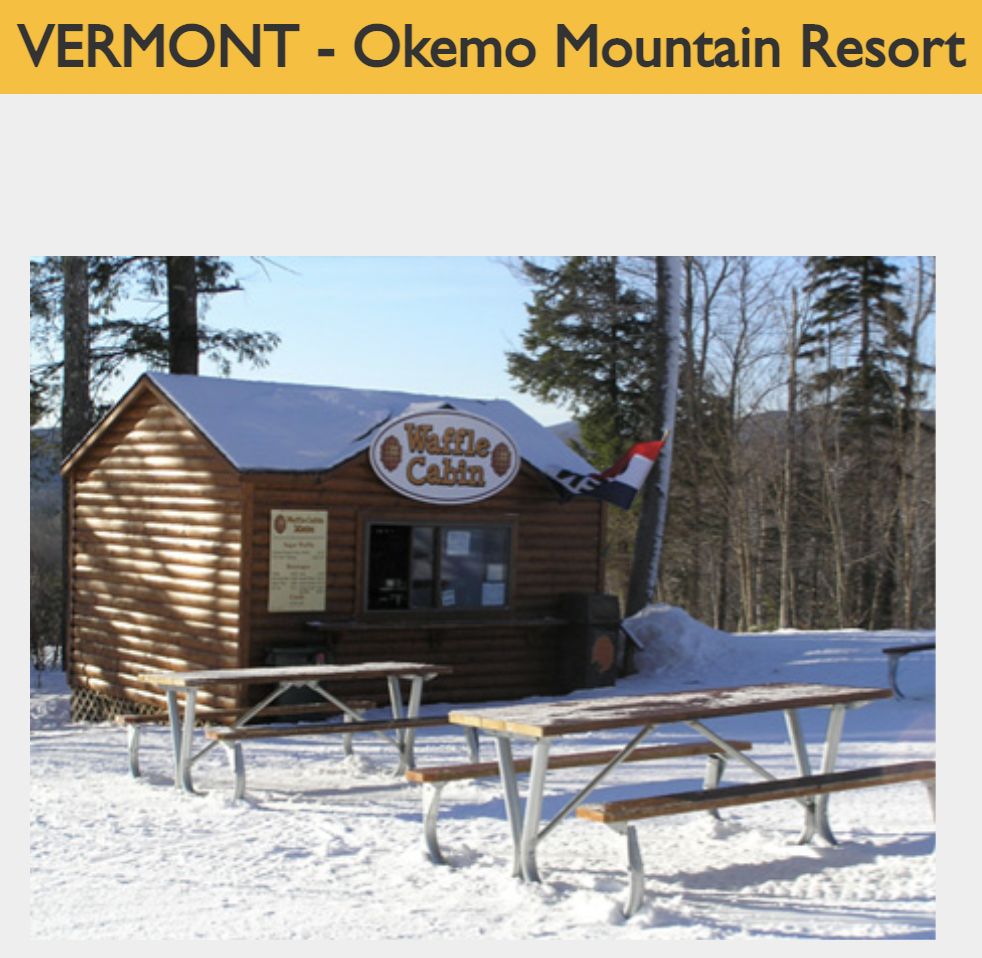

# Waffle Cabin

**Author**: annieetang

**CTF**: Patriot CTF

**Description**:

*I ate this really amazing waffle after some icy runs, but through an unkown series of events, I completely forgot where this was. Can you help me locate the ski resort this was at? Your life depends on this answer, you only have 2 guesses!*

*Flag format: PCTF{Full_Resort_Name} <- underscores instead of spaces*

*Note, feel free do DM me if you get this wrong but think you were right. I may be lenient on this one.*

*Challenge Author: NihilistPenguin (Daniel Getter)*

**Hints**: n/a

## Solution

After opening the image, we see there's the Waffle Cabin logo and even their website URL on the sign: [www.wafflecabin.com](www.wafflecabin.com). The next step is to visit this wonderful page, and we can see under the `Locations` tab that there are 35 Waffle Cabin locations.

The great part of their website is that each location generally has an up to date picture of the location and cabin structure. We can use this picture to compare with the challenge picture:

After looking through all the locations, there were two locations that seemed pretty reasonable: Belleayre Mountain and maybe Okemo Mountain Resort:

Belleyare:

Okemo:

At first, it seems like the Belleyare cabin itself looks exactly like the challenge picture, but the background in the Okemo cabin looks like the challenge picture. So I did further research on each of the Waffle Cabins with Google, and it seems that there are reviews of Okemo Mountain Resort with similar pictures as the challenge picture. Okemo probably just had a small makeover from when its picture was uploaded onto [www.wafflecabin.com](www.wafflecabin.com) and when the challenge picture was taken.
