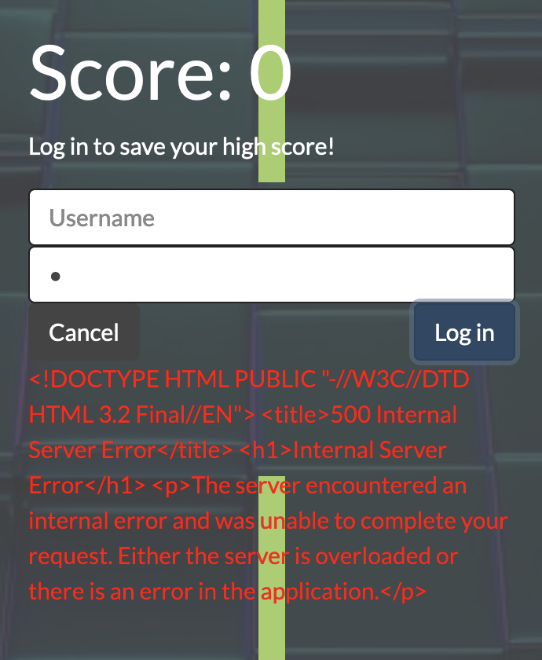
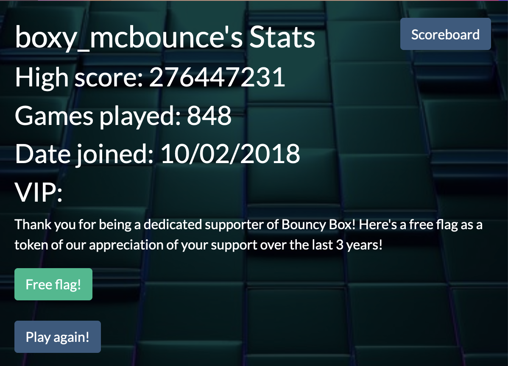
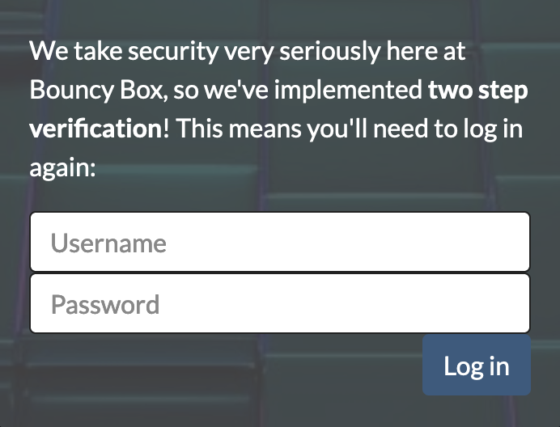

# Bouncy Box
**Author**: S|{oto

**CTF**:  DamCTF

**Description**: *"This game is extremely fun. So fun that some people have been playing it for over 3 years!"*

bouncy-box.chals.damctf.xyz

**Hints**: n/a

**Write-up:**

After you play the game, you're presented with a login popup to save your score.  When looking at the popup, my first instinct was to check if it was vulnerable to SQL injection.  Putting a`"`in the "Password" field only gets you a "*Incorrect username or password!*" message, but `'` leads to...



It seems, then, that this *can* be exploited with SQL, and it's using `'`s as its delimiter of choice!  One classic SQL injection line is `'OR''='`, which escapes out of the string where the password would normally be stored, then ORs it against `'='`, which always evaluates to true.  In other words, the password will always be evaluated as correct, assuming that the server's password checking isn't well made.

So, if we put `'OR''='`into the password line, even without anything in the Username field, it will log you into the account of **boxy_mcbounce**.



Now, it seems like you've already won, but if you click on "Free flag!", you're just led to *another* login page.



With testing, we can confirm that this login is setup correctly, and cannot be bypassed with SQL injection.  So, to get around this, we need to go back to the ***first*** login popup, which we know had SQL vulnerabilities.  There, we can use SQL injection to get information about other users' usernames and passwords.  Once we have those, we'll be able to input them into the second of the two logins and actually get the flag.

To make the SQL injection easier for us, we'll be using SQLMap, which can be found 

[here](https://sqlmap.org/).  To run SQLMap, you enter...

```
$ sql python3 sqlmap.py -wizard
```

This starts SQLMap's wizard, which will do most of the work for us.  When prompted with the following lines, I set the parameters as follows...

```
Please enter full target URL (-u): https://bouncy-box.chals.damctf.xyz/
POST data (--data) [Enter for None]: 
Injection difficulty (--level/--risk). Please choose: 2
Enumeration (--banner/--current-user/etc). Please choose: 3
```

SQLMap will automatically recognize that the forms on the page are vulnerable to SQL Injection, and enumerate through different types of injection.  Give it plenty of time to run.  At the end of its processing, it will output the underlying table that Bouncy Box uses to store usernames and passwords.  

Lucky for us, Bouncy Box stores its passwords in plain text, so we can simply find **boxy_mcbounce**'s password: `B0UncYBouNc3`.  At that point, we go back to the login page and use the Username `boxy_mcbounce` and Password `B0UncYBouNc3`.  Then, use the same credentials on the second "Free flag!" Login, and the flag is yours: `dam{b0uNCE_B0UNcE_b0uncE_B0uNCY_B0unce_b0Unce_b0Unc3}`.

